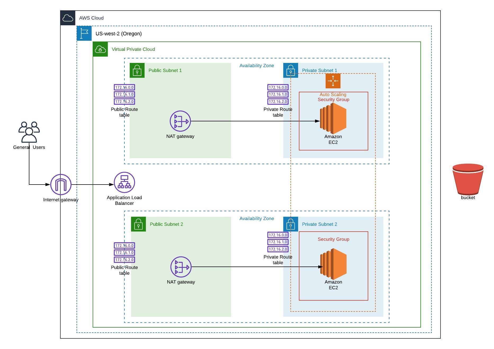

# Deploy a High-Availability Web Application Using AWS CloudFormation

## Project Overview:

 Deploy an application (Apache Web Server) and also pick up code (JavaScript and HTML) from S3 Storage and deploy it on the web server using AWS CloudFormation.
 
 ## Infrastructure Architecture:
 
 
 
 ---
 
 ### About Files:
 
* `create-stack.sh` : Script to create CloudFormation stack.
* `update-stack.sh` : Script to update CloudFormation stack.
* `network.yml` : Used to create Network Infrastructure for the Web Server.
* `network-parameters.json` : Parameters for Network Infrasturcture.
* `servers.yml` : Used to create servers and load Balancer.
* `servers-parameters.json` : Parameters for creating servers.
* `delete-stack.sh` : Script to delete CloudFormation stack.

### To deploy:
1. Upload the Website file in S3 bucket and update the Bucket name in servers.yml file.
2. Run: `./create-stack.sh network.yml network-parameters.json` - It will create necessary VPC, Internet Gateway, Subnet, Route Table and Nat Gateway.
3. Run: `./create-stack.sh servers.yml servers-parameters.json` - It will create Servers, Auto Scaling and Load Balancer.
